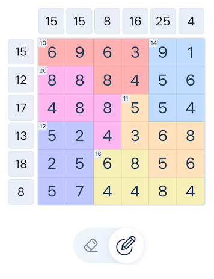

# sums

こういうゲームをとくためのツール。



縦、横、あるいは、同じ色の領域のマス目の合計があうようにマス目を消す、あるいは、確定する。

考え方として、領域内のすべてのマス目の順列を用意する。先頭から足していって合計があうものを調べていき、その時に各マス目が使われた回数をカウントしていく。

* 合計があう順列の個数と使われた回数が一致するときは、そのマス目は必須のマス目であることがわかる。
* 使われた回数がゼロのときは不要なマス目であることがわかる。

たとえば右上の青の領域の場合は

* 合計：14
* 領域内の数列：[9,1,5,6,5,4]

となる。

このツールでは以下のようにすると

```
% sums.exe 14 9,1,5,6,5,4
sum: 14
nums: [9 1 5 6 5 4]
0:9=>78% (132/168)
1:1=>21% (36/168)
2:5=>50% (84/168)
3:6=>0% (0/168)
4:5=>50% (84/168)
5:4=>42% (72/168)
```

3番目の要素の「6」の使用率が0パーセントであり、不要なマス目であることがわかるので消すことができる。

これを縦横や各色の領域に繰り返し行うことで、必須のマス目と不要なマス目を判定していくことができる。
